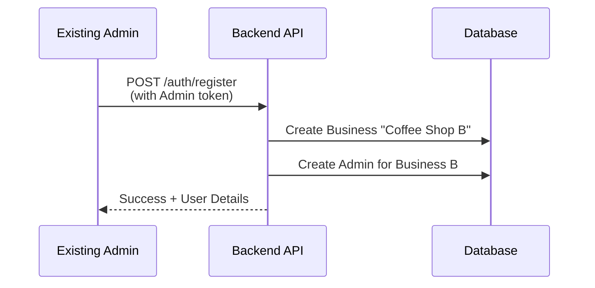

# Multi-Tenancy Integration Guide

## 🎯 Overview

The POS Backend has been refactored to support **Multi-Tenancy**, allowing multiple independent businesses to use the same system. Each business has its own data (products, categories, transactions, users) that is completely isolated from other businesses.

## 📋 Table of Contents

1. [What Changed](#what-changed)
2. [User Roles](#user-roles)
3. [Breaking Changes](#breaking-changes)
4. [Migration Steps](#migration-steps)
5. [Authentication Flow](#authentication-flow)
6. [API Changes](#api-changes)
7. [Frontend Integration](#frontend-integration)
8. [Testing](#testing)

---

## What Changed

### User Role Hierarchy

**NEW: Three-tier role system**

| Role | Description | Can Do |
|------|-------------|--------|
| `ADMIN` | Platform owner (you) | Register new businesses, manage platform |
| `BUSINESS_OWNER` | Customer (business owner) | Manage their business (products, categories, users, transactions) |
| `KASIR` | Employee (cashier) | View products, create transactions, read-only access |

**This enables a SaaS model** where:
- You (platform admin) onboard customers
- Customers (business owners) manage their own businesses
- Each business can have multiple employees (kasir)

### Database Schema

**New `Business` Table**
```prisma
model Business {
  id        String   @id @default(cuid())
  name      String
  address   String?
  phone     String?
  
  users        User[]
  categories   Category[]
  products     Product[]
  transactions Transaction[]
}
```

**All entities now have `businessId`:**
- `User` → belongs to a Business
- `Category` → belongs to a Business
- `Product` → belongs to a Business
- `Transaction` → belongs to a Business

### JWT Token Structure

The JWT token now includes `businessId`:

```json
{
  "sub": "user-id",
  "email": "admin@example.com",
  "role": "ADMIN",
  "businessId": "business-id"  // ← NEW
}
```

### Automatic Data Filtering

All API endpoints now **automatically filter** data by the authenticated user's `businessId`. You don't need to manually add businessId to requests - it's extracted from the JWT token.

---

## Breaking Changes

> [!CAUTION]
> The following changes will break existing integrations and require updates to your frontend/admin application.

### 1. User Roles Changed

**BEFORE:**
- `ADMIN` - Could manage products, categories, users
- `KASIR` - Employee with limited access

**NOW:**
- `ADMIN` - Platform owner (registers new businesses)
- `BUSINESS_OWNER` - Manages products, categories, users for their business
- `KASIR` - Read-only employee

**Migration Required:**
- Existing `ADMIN` users in your database may need to be updated to `BUSINESS_OWNER` if they are customer business owners, not platform admins.

### 2. Registration Endpoint Behavior Changed

**BEFORE:**
- `POST /auth/register` created a user in a global shared space

**NOW:**
- `POST /auth/register` creates:
  - A **NEW Business**
  - A **NEW Admin** for that business
- Requires authentication (Admin token)

### 2. New User Creation Endpoint

**To add employees (Kasir) to an existing business, use:**

```bash
POST /users
```

**NOT** `POST /auth/register` (which creates a new business)

### 3. All API Responses Are Scoped

Previously, `GET /menu` might return all products globally. Now it only returns products for **your business**.

---

## Migration Steps

### Step 1: Update Authentication Logic

**If you're storing the JWT token**, ensure you're sending it in all requests:

```javascript
// ✅ Correct
axios.get('/menu', {
  headers: {
    'Authorization': `Bearer ${accessToken}`
  }
})

// ❌ Wrong (JWT token missing, can't determine businessId)
axios.get('/menu')
```

### Step 2: Update User Registration Flow

If your admin app has a "Create User" feature, determine which endpoint to use:

| Goal | Endpoint | Payload |
|------|----------|---------|
| Create a new Business + Owner | `POST /auth/register` | Includes `businessName` |
| Add employee (Kasir) to current business | `POST /users` | No `businessName` |

**Example: Adding a Kasir**

```bash
POST /users
Authorization: Bearer <ADMIN_TOKEN>
Content-Type: application/json

{
  "email": "kasir1@myshop.com",
  "password": "password123",
  "name": "John Doe",
  "role": "KASIR"
}
```

### Step 3: Remove Manual `businessId` Handling

If you were previously passing `businessId` manually in request bodies or query parameters, **remove it**. The backend extracts it from the JWT token automatically.

```javascript
// ❌ OLD (No longer needed)
axios.post('/menu', {
  name: 'Coffee',
  price: 15000,
  businessId: 'abc123'  // Remove this
})

// ✅ NEW (businessId extracted from token)
axios.post('/menu', {
  name: 'Coffee',
  price: 15000
})
```

### Step 4: Test Data Isolation

Verify that:
1. Admin A cannot see Admin B's products
2. Kasir can only see products from their own business
3. Transactions are scoped to the business

---

## Authentication Flow

### Scenario 1: Register New Business Owner (SaaS Mode)



**cURL Example:**

```bash
# Step 1: Login as platform admin
curl -X POST http://localhost:3000/auth/login \
  -H 'Content-Type: application/json' \
  -d '{
    "email": "platform@admin.com",
    "password": "platform123"
  }'

# Step 2: Use token to register new business owner
curl -X POST http://localhost:3000/auth/register \
  -H 'Content-Type: application/json' \
  -H 'Authorization: Bearer <TOKEN_FROM_STEP_1>' \
  -d '{
    "email": "owner@newshop.com",
    "password": "password123",
    "name": "New Shop Owner",
    "businessName": "New Coffee Shop",
    "role": "BUSINESS_OWNER"
  }'
```

### Scenario 2: Add Employee to Existing Business

```bash
curl -X POST http://localhost:3000/users \
  -H 'Content-Type: application/json' \
  -H 'Authorization: Bearer <BUSINESS_OWNER_TOKEN>' \
  -d '{
    "email": "kasir1@myshop.com",
    "password": "password123",
    "name": "John Doe",
    "role": "KASIR"
  }'
```

---

## API Changes

### Endpoints That Changed

| Endpoint | OLD Behavior | NEW Behavior |
|----------|--------------|--------------|
| `POST /auth/register` | Create user globally | Create Business + Owner (requires auth) |
| `GET /menu` | All products | Products for **your business** only |
| `GET /categories` | All categories | Categories for **your business** only |
| `GET /transactions` | All transactions | Transactions for **your business** only |
| `GET /users` | All users | Users in **your business** only |

### New Endpoints

| Method | Endpoint | Description |
|--------|----------|-------------|
| `POST` | `/users` | Add employee (Kasir/Admin) to your business |

---

## Frontend Integration

### 1. Update Login Success Handler

After successful login, ensure you:
1. Store the `accessToken`
2. Include it in all subsequent API requests

**Example (React/Axios):**

```javascript
// Login
const { data } = await axios.post('/auth/login', {
  email: 'admin@pos.com',
  password: 'admin123'
});

// Store token
localStorage.setItem('token', data.data.accessToken);

// Configure axios to always send token
axios.defaults.headers.common['Authorization'] = `Bearer ${data.data.accessToken}`;
```

### 2. Update User Creation UI

**Add a dropdown or separate forms:**

- **Option A:** "Add Employee" → `POST /users`
- **Option B:** "Register New Business" → `POST /auth/register`

**Example UI Flow:**

```
┌──────────────────────────────────┐
│  User Management                 │
├──────────────────────────────────┤
│  [ Add Employee to My Business ] │  ← POST /users
│  [ Register New Business Owner ] │  ← POST /auth/register
└──────────────────────────────────┘
```

### 3. Handle Business Context

Optionally, display the current business name in your UI:

```javascript
// After login, user object includes businessId
const user = data.data.user;
console.log(user.businessId); // "cm5a1b2c3d4e5f6g7h8i9j0k"

// Optionally fetch business details
const business = await axios.get(`/businesses/${user.businessId}`);
console.log(business.data.name); // "Kedai Kita"
```

---

## Testing

### Manual Testing Checklist

- [ ] Login as Admin A
- [ ] Create products as Admin A
- [ ] Register new Business Owner (Admin B)
- [ ] Login as Admin B
- [ ] Verify Admin B **cannot** see Admin A's products
- [ ] Create products as Admin B
- [ ] Login as Admin A again
- [ ] Verify Admin A **cannot** see Admin B's products

### Automated Testing Script

A verification script is included in the repository:

```bash
npx ts-node verify_tenancy.ts
```

This script:
1. Logs in as Business A
2. Registers Business B
3. Verifies data isolation between the two businesses

**Expected Output:**

```
✅ Business A has 98 products.
✅ Business B sees 0 products.
✅ No ID overlap between A and B products.
✅ VERIFICATION SUCCESSFUL! Multi-tenancy is working correctly.
```

---

## FAQ

### Q: Can I create a public registration page (no token required)?

**A:** Currently, `POST /auth/register` requires Admin authentication for security. To allow public registration:

1. Edit `src/auth/auth.controller.ts`
2. Remove the guards from the register endpoint:

```typescript
@Post('register')
// @UseGuards(JwtAuthGuard, RolesGuard)  ← Comment out
// @Roles(UserRole.ADMIN)                 ← Comment out
async register(@Body() registerDto: RegisterDto) {
  return this.authService.register(registerDto);
}
```

### Q: How do I migrate existing data?

**A:** If you have existing users/products without a business:

1. Run the seed script to create a default business:
   ```bash
   npm run seed
   ```
2. This will create "Kedai Kita" business and link all orphaned data to it.

### Q: What happens if I delete a Business?

**A:** Deleting a business will cascade delete:
- All users
- All products
- All categories
- All transactions

**Use with caution!**

### Q: Can users belong to multiple businesses?

**A:** No, each user belongs to exactly one business. If you need this, the schema would need to be updated to a many-to-many relationship.

---

## Support

For questions or issues:
1. Check the [API endpoint list](./README.md#endpoints)
2. Review the verification script: `verify_tenancy.ts`
3. Contact the backend team

---

## Summary

> [!IMPORTANT]
> **Key Takeaways:**
> 1. All data is now scoped by `businessId`
> 2. JWT token includes `businessId` - no manual passing needed
> 3. Use `POST /users` to add employees, not `POST /auth/register`
> 4. `POST /auth/register` now creates a new business
> 5. Test data isolation thoroughly before deploying

**Happy coding! 🚀**
