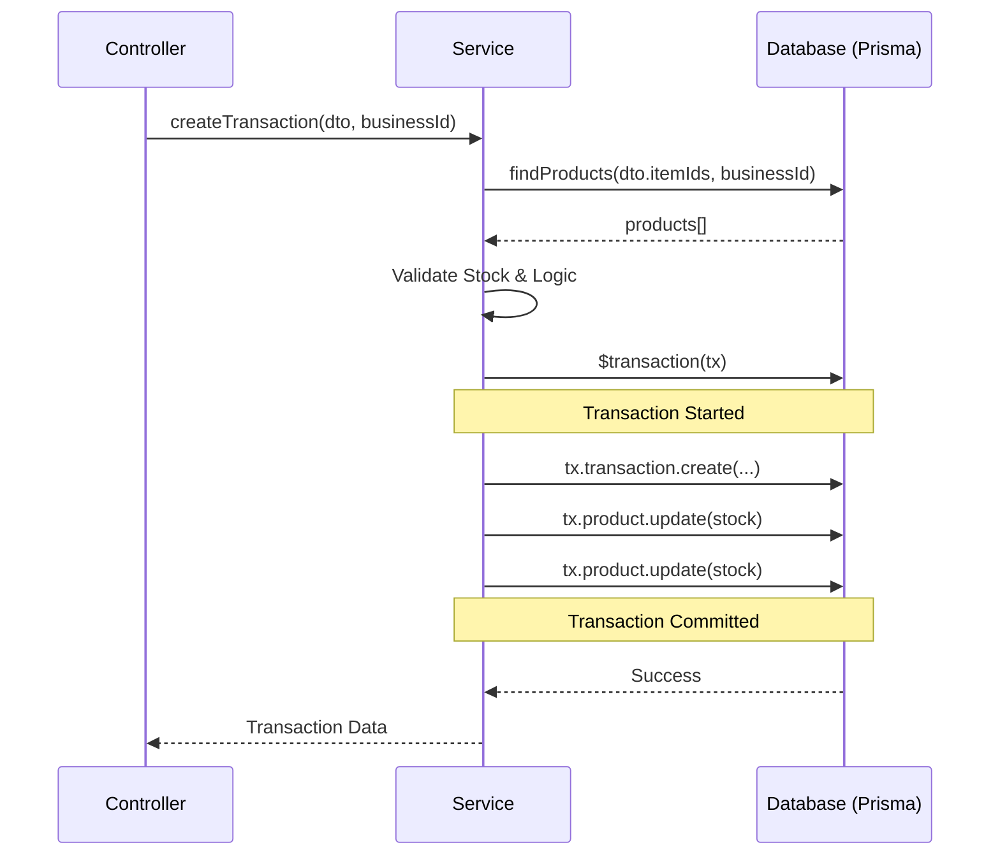

# Service Transaction Guide

This guide explains how to implement and manage database transactions within the service layer of the POS system using Prisma and NestJS.

---

## 1. Why Use Transactions?

In a Point of Sale (POS) system, data integrity is paramount. A single "Create Transaction" operation often involves multiple database updates that must succeed or fail together:
1.  Creating the **Transaction** record.
2.  Creating multiple **TransactionItems**.
3.  Updating **Product Stocks**.
4.  Optionally updating **Business** daily totals.

If the stock update fails but the transaction record is created, your inventory will be out of sync. Transactions prevent this by ensuring **Atomicity**.

## 2. Prisma `$transaction` API

We use the interactive transaction API in Prisma to handle complex logic within a transaction block.

### Basic Syntax

```typescript
await this.prisma.$transaction(async (tx) => {
  // Use 'tx' instead of 'this.prisma' for all operations
  const result = await tx.model.create({ ... });
  await tx.otherModel.update({ ... });
  return result;
});
```

## 3. Real-World Example: `create`

Located in: [`src/transactions/transactions.service.ts`](file:///Users/ptsiagaabdiutama/Documents/pos/posbackend/src/transactions/transactions.service.ts)

The `create` method handles both creating a new transaction and appending items to an existing pending transaction (for table-based service).

### Key Implementation Details:

1.  **Preparation**: Validate products and check stock *before* opening the transaction to keep the transaction block as short as possible.
2.  **Interactive Transaction**: The logic inside `$transaction` ensures that if any item creation or stock update fails, the whole transaction rolls back.
3.  **Scoped for Multi-tenancy**: Every query includes `businessId` to ensure data isolation.

```typescript
async create(createTransactionDto: CreateTransactionDto, userId: string, businessId: string) {
  // ... validation logic ...

  return this.prisma.$transaction(async (tx) => {
    // 1. Create/Update Transaction
    const newTransaction = await tx.transaction.create({
      data: {
        // ... data ...
        businessId, // CRITICAL: Always include businessId
        items: {
          create: transactionItems,
        },
      },
      include: { items: true },
    });

    // 2. Loop through items to update stock
    for (const item of items) {
      const product = products.find((p) => p.id === item.productId);
      const newStock = product.stock - item.quantity;
      
      await tx.product.update({
        where: { id: item.productId },
        data: {
          stock: newStock,
          status: newStock > 0 ? 'AVAILABLE' : 'OUT_OF_STOCK',
        },
      });
    }

    return newTransaction;
  });
}
```

## 4. Best Practices

-   **Use `tx` for everything**: Inside the `$transaction` callback, NEVER use `this.prisma`. Use the transaction client `tx` provided as an argument.
-   **Keep it Short**: Do heavy computation, file uploads, or external API calls *outside* the transaction block. Only database operations should be inside.
-   **Error Handling**: NestJS will automatically catch exceptions thrown inside `$transaction` and roll it back. You can throw `BadRequestException` or `NotFoundException` to trigger a rollback with a specific error message.
-   **Multi-tenancy**: Always ensure `businessId` is passed and used in every query inside the transaction.

## 5. Summary of Flow



---

> [!IMPORTANT]
> Always verify that your transaction logic includes `businessId` scoping to prevent data leaks between different tenants in the multi-tenant architecture.
